# 🧞‍♂️ 캐톡 (Character Talk) 🎅🏻

## 💻 `프로젝트 소개 & 개발 동기`
<b>사용자가 좋아하는 만화 캐릭터와 한국어로도 자연스럽게 대화할 수 있는 AI 캐릭터 채팅 프로그램을 개발하였습니다. 기존 캐릭터 AI 대화 서비스들은 한국어 대화에서 어색한 표현과 부자연스러운 문맥이 자주 발생하는 문제점이 있었습니다. 우리는 이를 개선하고, 한국어 사용자들에게 더욱 자연스러운 대화 경험을 제공하는 데 초점을 맞춰 기능들을 구현하였습니다.</b>

- 특화된 한국어 대화 시스템 구축
    - 한국어로 된 인물 이름이나 대사 등을 벡터 스토어에서 자동으로 가져와 프롬프트에 반영함으로써, 한국인 사용자가 보다 자연스럽고 몰입감 있는 대화를 경험할 수 있도록 했습니다. 기존의 다른 사이트들에서는 한국어로 대화할 때 등장 인물들의 한글 이름이나 대사를 못알아듣거나 어색하게 표현되는 경우가 많았고(ex. 스폰지밥의 ‘뚱이’ <=> Patrick), 종종 캐릭터를 제대로 인식하지 못하는 문제가 있었습니다. 이러한 문제를 해결하고, 사용자가 캐릭터와의 대화에서 느낄 수 있는 어색함을 최소화하여 더욱 자연스러운 대화 경험을 제공했습니다.

- 사용자의 재미와 몰입도를 높이는 기능 추가
    - 단순한 캐릭터와의 대화를 넘어, 사용자가 더 다양한 방식으로 캐릭터와 상호작용할 수 있도록 단체 채팅 기능과 밸런스 게임 등을 도입했습니다. 이를 통해 여러 캐릭터와 동시에 대화하거나, 사용자가 원하는 상황에서 새로운 인격이 부여된 캐릭터와 색다른 대화를 나누는 경험을 제공합니다.

- 연재 종료 후에도 세계관 안에서 캐릭터와의 상호작용 가능
    - 시즌 연재가 끝난 후에도, 사용자가 좋아하는 캐릭터와 계속해서 만화의 세계관 속에서 대화하며 여운을 지속적으로 느낄 수 있는 기능을 추가했습니다. 이를 통해 팬들이 캐릭터와의 관계를 유지하며 더욱 깊이 있는 스토리를 경험할 수 있도록 하였습니다.

<br/>

## 🧑‍🤝‍🧑 `멤버구성 & 담당 역할`

 - 🦗 팀장: 이득규
   - TTS 음성 트레이닝
       - 팀원들의 목소리를 학습시켜 각자 담당한 캐릭터의 어조와 어투에 맞춰 음성의 느낌을 조정
   - 인기 캐릭터 조회수
   - 김전일 프롬프트 작성
     
 - 🐯 형상관리자: 홍주연
   - 1:1 채팅 Back, Fast API (+ Front 초기 틀) 기능 구현
       - 사용자의 질문에 대해 캐릭터의 정보(대사, 배경, 성격 등)를 벡터 스토어에서 먼저 검색한 후, 이 정보를 바탕으로 더 자연스럽고 정확한 맞춤형 답변을 생성하도록 하여, AI가 실제 캐릭터처럼 반응할 수 있게 RAG 기법을 이용해 프롬프트에 반영하는 기능 작성
   - 단체 채팅 Back, Fast API 기능 구현
   - FAST API 서버 시작 시 각 캐릭터들의 정보(pdf / 웹 문서)를 retriever로 서버에 로드 및 벡터 스토어에 저장
   - AI 메세지의 감정을 분석하여 상황에 맞게 이미지 라우팅
   - 채팅 내역 기억 및 페이징 처리
   - 스폰지밥, 버즈 프롬프트 작성

 - 🐶 형상관리자: 지동현
   - 구글/카카오 oAuth 로그인
   - 채팅방(단일/단체) 관련 프론트와 백엔드 사이 기능 연결
   - 프론트에서 Redux-persist 로 글로벌 변수 관리
   - 네비게이션 바, 채팅방 디자인
   - 리바이 프롬프트 작성
  
 - 🐹 리뷰어: 배하은
   - 메인페이지, 채팅방, 밸런스 게임 선택지 디자인
   - 밸런스 게임 프롬프트 작성
       - 유저가 원하는 상횡을 부여하여 프롬프트에 적용
   - 에스카노르 낮/밤 프롬프트 작성

 - 🐻 리뷰어: 박효찬
   - 네비게이션 바 디자인 및 구현
   - 최근 채팅한 방 정보 네비게이션 바에 불러오기
   - 플랑크톤 프롬프트 작성

<br/>

## ⚙️ `개발 환경`


<br/>
<br/><h2>📂 패키지구조</h2>

<details>
  <summary><b>프론트엔드 패키지 구조</b></summary>
  <div markdown="1">

```
C:.
|   .env
|   .gitignore
|   package-lock.json
|   package.json
|   README.md
|   tree.txt
|   
+---public
|   |   c-talk.ico
|   |   c-talk.png
|   |   index.html
|   |   manifest.json
|   |   robots.txt
|   |   
|   \---images
|           google_logo.png
|           icon-login.png
|           icon-login2.png
|           kakao_logo.png
|           캐릭터1.png
|           캐릭터2.png
|           캐릭터3.png
|           
\---src
    |   App.js
    |   index.js
    |   ProtectedRoute.js
    |   Store.js
    |   TestPage.js
    |   
    +---apis
    |       Apis.js
    |       ChatAPICalls.js
    |       ImageAPICalls.js
    |       UserAPICalls.js
    |       
    +---components
    |   |   GroupChatFormModal.js
    |   |   LoginModal.js
    |   |   ProfileModal.js
    |   |   
    |   \---commons
    |           Navbar.js
    |           
    +---css
    |       balanceChat.css
    |       balanceGame.css
    |       chat.css
    |       GroupChatFormModal.css
    |       LoginModal.css
    |       Navbar.css
    |       ProfileModal.css
    |       selectCharacterList.css
    |       UserMain.css
    |       
    +---images
    |       icon.png
    |       mypage.png
    |       
    +---layouts
    |       Layout.js
    |       
    +---modules
    |       ChatModule.js
    |       ImageModule.js
    |       index.js
    |       UserModule.js
    |       
    \---pages
        |   UserMain.js
        |   
        +---balanceGame
        |   |   balanceChat.js
        |   |   balanceGame.js
        |   |   
        |   \---images
        |           Refresh.png
        |           Sms.png
        |           김전일.jpg
        |           리바이.webp
        |           버즈.jpg
        |           상황1.png
        |           스폰지밥.jpg
        |           에스카노르.jpg
        |           플랑크톤.jpg
        |           
        +---chat
        |   |   BalanceMessage.js
        |   |   ChatRoom.js
        |   |   Message.js
        |   |   
        |   \---images
        |           Button Play.png
        |           down.png
        |           list_icon.png
        |           loading1.gif
        |           loading2.gif
        |           loading3.gif
        |           loading4.gif
        |           loading5.gif
        |           loading6.gif
        |           
        +---selectCharacterList
        |   |   selectCharacterList.js
        |   |   
        |   \---images
        |           icon.png
        |           
        \---user
                Login.js
```
    
  </div>
</details>


<details>
  <summary><b>백엔드 패키지 구조</b></summary>
  <div markdown="1">

```
C:.
|   .gitattributes
|   .gitignore
|   build.gradle
|   gradlew
|   gradlew.bat
|   HELP.md
|   settings.gradle
|   tree.txt
|   
+---.gradle
|   |   file-system.probe
|   |   
|   +---8.10.2
|   |   |   gc.properties
|   |   |   
|   |   +---checksums
|   |   |       checksums.lock
|   |   |       md5-checksums.bin
|   |   |       sha1-checksums.bin
|   |   |       
|   |   +---dependencies-accessors
|   |   |       gc.properties
|   |   |       
|   |   +---executionHistory
|   |   |       executionHistory.bin
|   |   |       executionHistory.lock
|   |   |       
|   |   +---expanded
|   |   +---fileChanges
|   |   |       last-build.bin
|   |   |       
|   |   +---fileHashes
|   |   |       fileHashes.bin
|   |   |       fileHashes.lock
|   |   |       resourceHashesCache.bin
|   |   |       
|   |   \---vcsMetadata
|   +---buildOutputCleanup
|   |       buildOutputCleanup.lock
|   |       cache.properties
|   |       outputFiles.bin
|   |       
|   \---vcs-1
|           gc.properties
|           
+---.idea
|   |   .gitignore
|   |   compiler.xml
|   |   dataSources.local.xml
|   |   dataSources.xml
|   |   gradle.xml
|   |   jarRepositories.xml
|   |   misc.xml
|   |   modules.xml
|   |   sqldialects.xml
|   |   vcs.xml
|   |   workspace.xml
|   |   
|   +---dataSources
|   |   |   270ef987-d471-4581-a575-0672e3593532.xml
|   |   |   
|   |   \---270ef987-d471-4581-a575-0672e3593532
|   |       \---storage_v2
|   |           \---_src_
|   |               \---schema
|   |                       dlp_db.NePKsA.meta
|   |                       
|   \---modules
|           DLP_back.main.iml
|           
+---gradle
|   \---wrapper
|           gradle-wrapper.jar
|           gradle-wrapper.properties
|           
\---src
    +---main
    |   +---java
    |   |   \---com
    |   |       \---dlp
    |   |           \---back
    |   |               |   characterTalk.java
    |   |               |   
    |   |               +---auth
    |   |               |   |   AuthController.java
    |   |               |   |   RestTemplateConfig.java
    |   |               |   |   
    |   |               |   +---filter
    |   |               |   |       HeaderFilter.java
    |   |               |   |       JwtAuthorizationFilter.java
    |   |               |   |       
    |   |               |   +---handler
    |   |               |   |       JwtTokenProvider.java
    |   |               |   |       
    |   |               |   \---service
    |   |               |           CustomUserDetails.java
    |   |               |           CustomUserDetailsService.java
    |   |               |           
    |   |               +---character
    |   |               |   +---controller
    |   |               |   |       CharacterController.java
    |   |               |   |       
    |   |               |   +---domain
    |   |               |   |   +---dto
    |   |               |   |   |       CharacterDTO.java
    |   |               |   |   |       
    |   |               |   |   \---entity
    |   |               |   |           Character.java
    |   |               |   |           
    |   |               |   +---repository
    |   |               |   |       CharacterRepository.java
    |   |               |   |       
    |   |               |   \---service
    |   |               |           CharacterService.java
    |   |               |           
    |   |               +---chatMessage
    |   |               |   +---controller
    |   |               |   |       ChatMessageController.java
    |   |               |   |       
    |   |               |   +---domain
    |   |               |   |   +---dto
    |   |               |   |   |       CharacterMatchRequest.java
    |   |               |   |   |       CharacterMatchRequestFastAPI.java
    |   |               |   |   |       CharacterMatchResponseFastAPI.java
    |   |               |   |   |       ChatMessageDTO.java
    |   |               |   |   |       ChatRequest.java
    |   |               |   |   |       ChatRequestFastAPI.java
    |   |               |   |   |       ChatResponseFastAPI.java
    |   |               |   |   |       DeleteUserMessageRequest.java
    |   |               |   |   |       MsgImgRequest.java
    |   |               |   |   |       
    |   |               |   |   \---entity
    |   |               |   |           ChatMessage.java
    |   |               |   |           
    |   |               |   +---repository
    |   |               |   |       ChatMessageRepository.java
    |   |               |   |       
    |   |               |   \---service
    |   |               |           ChatMessageService.java
    |   |               |           
    |   |               +---chatRoom
    |   |               |   +---controller
    |   |               |   |       ChatRoomController.java
    |   |               |   |       
    |   |               |   +---domain
    |   |               |   |   +---dto
    |   |               |   |   |       ChatRoomDTO.java
    |   |               |   |   |       ChatRoomInfo.java
    |   |               |   |   |       ChatRoomResponse.java
    |   |               |   |   |       ChatRoomResponse2.java
    |   |               |   |   |       CreateChatRoomDTO.java
    |   |               |   |   |       GroupChatRoomInfo.java
    |   |               |   |   |       UpdateChatRoomDTO.java
    |   |               |   |   |       
    |   |               |   |   \---entity
    |   |               |   |           ChatRoom.java
    |   |               |   |           
    |   |               |   +---repository
    |   |               |   |       ChatRoomRepository.java
    |   |               |   |       
    |   |               |   \---service
    |   |               |           ChatRoomService.java
    |   |               |           
    |   |               +---common
    |   |               |       AuthConstants.java
    |   |               |       ResponseMessage.java
    |   |               |       
    |   |               +---config
    |   |               |       BeanConfiguration.java
    |   |               |       SwaggerConfig.java
    |   |               |       WebSecurityConfig.java
    |   |               |       
    |   |               +---images
    |   |               |   +---controller
    |   |               |   |       ImagesController.java
    |   |               |   |       
    |   |               |   +---domain
    |   |               |   |   +---dto
    |   |               |   |   |       ImagesDTO.java
    |   |               |   |   |       
    |   |               |   |   \---entity
    |   |               |   |           Images.java
    |   |               |   |           
    |   |               |   +---repository
    |   |               |   |       ImagesRepository.java
    |   |               |   |       
    |   |               |   \---service
    |   |               |           ImagesService.java
    |   |               |           S3Service.java
    |   |               |           
    |   |               +---member
    |   |               |   +---controller
    |   |               |   |       MemberController.java
    |   |               |   |       
    |   |               |   +---domain
    |   |               |   |   +---dto
    |   |               |   |   |       MemberDTO.java
    |   |               |   |   |       UpdateMemberDTO.java
    |   |               |   |   |       
    |   |               |   |   \---entity
    |   |               |   |           Member.java
    |   |               |   |           
    |   |               |   +---repository
    |   |               |   |       MemberRepository.java
    |   |               |   |       
    |   |               |   \---service
    |   |               |           MemberService.java
    |   |               |           
    |   |               \---participant
    |   |                   +---controller
    |   |                   |       ParticipantController.java
    |   |                   |       
    |   |                   +---domain
    |   |                   |   +---dto
    |   |                   |   |       ParticipantDTO.java
    |   |                   |   |       
    |   |                   |   \---entity
    |   |                   |           Participant.java
    |   |                   |           
    |   |                   +---repository
    |   |                   |       ParticipantRepository.java
    |   |                   |       
    |   |                   \---service
    |   |                           ParticipantService.java
    |   |                           
    |   \---resources
    |       |   application.yml
    |       |   Dummies.sql
    |       |   table_sessionId.sql
    |       |   
    |       +---static
    |       |   \---image
    |       |       +---characterProfile
    |       |       |       김전일.png
    |       |       |       리바이.png
    |       |       |       버즈.png
    |       |       |       스폰지밥.png
    |       |       |       에스카노르.png
    |       |       |       플랑크톤.png
    |       |       |       
    |       |       \---msgImg
    |       |           +---1
    |       |           |       1_1.jpg
    |       |           |       1_2.jpg
    |       |           |       1_3.jpg
    |       |           |       1_4.jpg
    |       |           |       1_5.jpg
    |       |           |       1_6.jpg
    |       |           |       1_7.jpg
    |       |           |       1_8.jpg
    |       |           |       2_1.jpg
    |       |           |       2_2.jpg
    |       |           |       2_3.jpg
    |       |           |       
    |       |           +---2
    |       |           |       1.jpg
    |       |           |       
    |       |           +---3
    |       |           |       1.jpg
    |       |           |       2_1.jpg
    |       |           |       2_2.jpg
    |       |           |       2_3.jpg
    |       |           |       2_4.jpg
    |       |           |       2_5.jpg
    |       |           |       2_6.jpg
    |       |           |       2_7.jpg
    |       |           |       2_8.jpg
    |       |           |       
    |       |           +---4
    |       |           |       1_1.jpg
    |       |           |       1_2.jpg
    |       |           |       1_3.jpg
    |       |           |       2_1.jpg
    |       |           |       2_2.jpg
    |       |           |       2_3.jpg
    |       |           |       2_4.jpg
    |       |           |       
    |       |           +---5
    |       |           |       1_1.jpg
    |       |           |       1_2.jpg
    |       |           |       1_3.jpg
    |       |           |       1_4.jpg
    |       |           |       1_5.jpg
    |       |           |       2_1.jpg
    |       |           |       2_2.jpg
    |       |           |       2_3.jpg
    |       |           |       
    |       |           \---6
    |       |                   1_1.jpg
    |       |                   1_2.jpg
    |       |                   1_3.jpg
    |       |                   1_4.jpg
    |       |                   1_5.jpg
    |       |                   1_6.jpg
    |       |                   1_7.jpg
    |       |                   2_1.jpg
    |       |                   2_2.jpg
    |       |                   2_3.jpg
    |       |                   2_4.jpg
    |       |                   
    |       \---templates
    \---test
        \---java
            \---com
                \---dlp
                    \---back
                            characterTalkTests.java
```
    
  </div>
</details>

<details>
  <summary><b>Fast API 패키지 구조</b></summary>
  <div markdown="1">

```
C:.
|   .env
|   .gitignore
|   chat_logic.py
|   main.py
|   models.py
|   tree.txt
|   TTS.py
|   
+---.vscode
|       settings.json
|       
\---data
        김전일.pdf
        리바이.pdf
        버즈.pdf
        스폰지밥.pdf
        에스카노르.pdf
        플랑크톤.pdf
```
    
  </div>
</details>


<br/>
<br/><h2>📌 주요 기능</h2>

<h3>1. 👾 회원가입 및 로그인 👾</h3>
<center><구글 로그인><br>
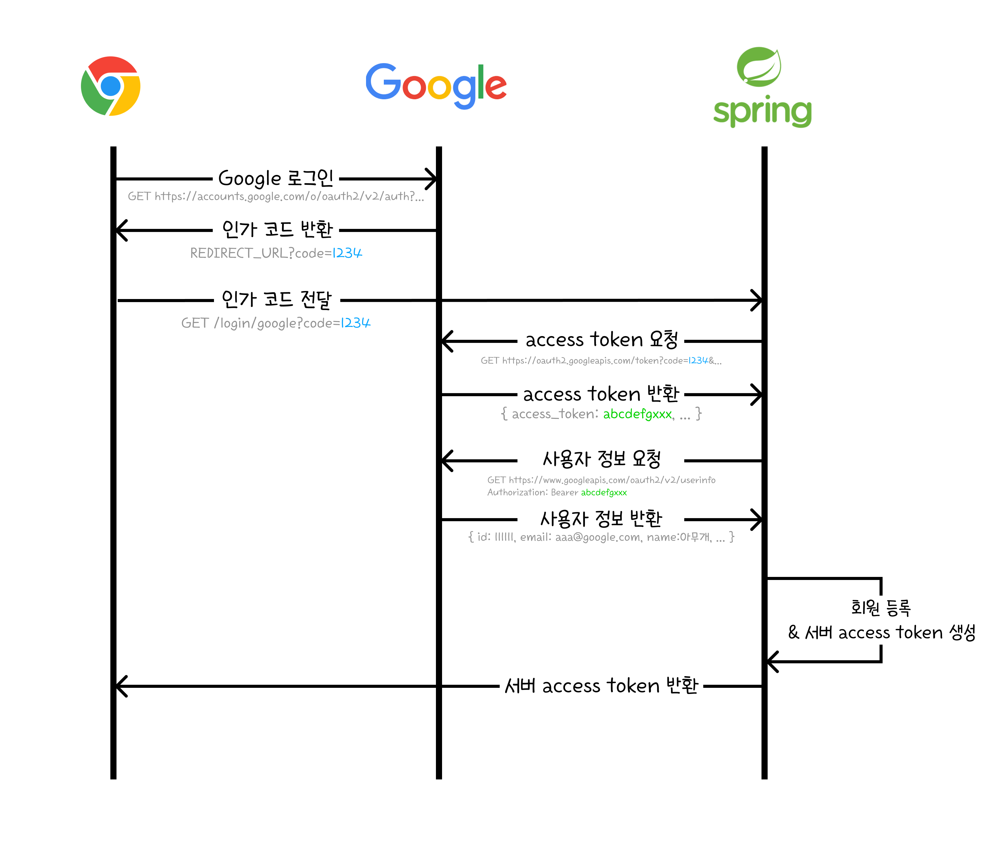<br></center>


    1. 클라이언트 서버에서 구글로 oauth 로그인 진행 -> 인가코드 반환

    2. 반환받은 인가코드로 구글에 access token 요청
      - 구글 tokenUrl에 인가코드 + 클라이언트ID + 클라이언트Secret + redirectURI를 담아서 restTemplate으로 API 요청 -> access token 반환받기
    
    3. access token을 통해 Google로부터 사용자 정보 요청 & 반환
    
    4. 사용자 정보 처리 및 회원가입
      - 기존에 회원가입이 되었다면 구글에서 요청받은 사용자 정보로 캐톡 서버에 로그인 진행, 회원 정보가 없다면 자동으로 회원가입 진행

    5. 백엔드 서버 access token 생성하여 프론트 서버로 전달 
      - localStorage 및 redux state에 반영
    
    ※ 카카오 로그인 로직도 이와 동일한 구조로 구현

<br/><h3>2. 🧚‍♀️ 캐릭터와 채팅 🧚‍♂️</h3>
- langchain의 SQLChatMessageHistory를 사용하여 이전 채팅 내역을 기억하고 있는 채로 대화하는 채팅 기능 구현
- FAST API 시작 시 retriever로 캐릭터 정보를 미리 서버에 로드 및 벡터 스토어에 저장 (유저가 채팅 기다리는 시간을 최소화)
    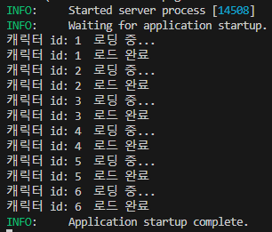
- 받아온 AI 메세지 내용의 감정을 프롬프트 이용해 분석하여 감정에 해당하는 캐릭터 별 이미지 매핑하여 보여주기
- 팀원들의 목소리를 학습시킨 음성 TTS 기능을 이용하여 AI 캐릭터의 메세지 읽어주는 기능
- 서버 관리 측면에서 한 번에 트래픽이 몰리는 상황을 방지하기 위해 채팅 히스토리는 접속 시 최신 메세지 10개만 가져오고 무한 스크롤 기능을 이용하여 스크롤 할 때마다 히스토리를 받아오게끔 구현

<br/><h4>2-1. 👩‍🎤 1:1 채팅 👨‍🎤</h4>
- 메인 페이지에서 캐릭터를 선택하면 채팅 시작 가능
- 선택한 캐릭터와 채팅한 내역이 없으면 데이터베이스에 새로운 방 생성, 내역이 있으면 기존 방에 접속 후 데이터베이스에서 채팅 히스토리 가져오기 (조회수 반영)
  - 선택한 캐릭터에게 질문을 보내면 AI 캐릭터와 채팅 가능

<br/><h4>2-2. 🧛‍♀️ 단체 채팅 🧛‍♂️</h4>
- 여러개의 캐릭터들을 선택하여 단체 채팅 방 생성
- 유저가 질문을 보내면 단체방에 있는 캐릭터들 중 어떤 캐릭터가 대답하기에 적합한지 프롬프트를 통해 선정
  - 선정된 캐릭터들의 프롬프트를 체인에 연결하여 각각의 캐릭터에게서 질문에 대한 답장 반환 <br/>
    (같은 질문에 대해 앞서 대답한 AI 캐릭터들의 히스토리도 함께 반영하여 답장을 작성하도록 구현)

<br/><h3>3. 🕵️‍♂️ 밸런스 게임 🕵️‍♀️</h3>
- 다양한 성격을 랜덤적으로 캐릭터에게 부여하고, 부여된 성격과 캐릭터Id로 해당되는 프롬프트를 찾아 반환
- 입력한 상황을 prompt에 넣고 유지하여 대화 흐름에 반영되도록 구현

<br/>

## 🗣️ 후기

>- <b>🦗 이득규 🦗</b><br>
   'LLM의 활용을 극대화해보자'
 라는 것이 이 프로젝트의 목표였습니다. 캐릭터AI챗봇의 구현 --> 단체방 생성 --> 캐릭터AI의 응답을 음성으로도 반환해주기 --> 캐릭터 음성에 우리의 목소리를 학습시키기 --> 추가 콘텐츠를 제작하기 등으로 점진적으로 목표를 수정하였고 이를 전부 달성하였습니다.
목표를 달성할 수 있었던 건 처음부터 허황된 목표를 설정하지 않고 작은 것부터 하나씩 구현해나간 것도 있지만 팀원 모두가 프로젝트 초기에 비해 LLM과 fastAPI에 대한 이해도가 대폭 증가한 것 덕분이라고 생각합니다.<br>
 또한 단순히 프로젝트의 결과물이 만족스러운 것이 아니라 과정도 참으로 뜻깊었습니다. 매일 매일 노션을 통해 협업했고 이슈관리도 놓치지 않고 틈틈히 하였습니다. 이 과정에서 Fine-Tuning을 좀 더 적절한 Prompt Engineering으로 대체하고 Coqui-TTS나 GTTS를 사용한 코드를 과감히 삭제하고 elevenlabs를 사용하는 등 프로젝트에 대한 끊임없는 보강이 있었습니다. 이를 통해 프로젝트 결과물의 퀄리티를 높일 뿐만 아니라 가동속도, 비용 절감 등 효율성 또한 잡을 수 있었다고 생각합니다.<br>
 지금까지 진행했던 프로젝트 중 가장 만족스러웠던 프로젝트였던 만큼 프로젝트의 대부분을 차지하는 장점은 취하고 약간의 아쉬움은 보완하여 다음 프로젝트에서의 귀감으로 삼을 생각입니다. 마지막으로 추후 프로젝트의 배포를 통해 대중의 피드백도 수렴할 생각입니다.
 

>- <b>🐯 홍주연 🐯</b><br>
    &nbsp;&nbsp;&nbsp;&nbsp;이번 프로젝트는 기존에 익숙했던 Java, Spring, Python 외에 AI 기술을 활용하여 프로그램을 개발한 경험이어서 더욱 의미 있는 경험이었습니다. 특히, LLM, RAG, Fine-Tuning, Prompt Engineering 등과 같은 새로운 개념과 최신 기술들을 배우고 실제로 응용해보는 소중한 기회가 되었습니다.<br>
&nbsp;&nbsp;&nbsp;&nbsp;하지만 이러한 기술들이 비교적 최근에 등장했고 여전히 개발 중인 분야다 보니 참고할 수 있는 자료나 레퍼런스가 부족해 어려움이 많았습니다. 그래서 직접 부딪히고 테스트해보며 배워야 했지만 그 과정에서 많은 것을 얻을 수 있었습니다.<br>
&nbsp;&nbsp;&nbsp;&nbsp;LangChain 기술을 사용하면서 느낀 한계점도 있었는데, LangChain이 고정된 기능을 수행하는 데는 강점이 있었지만, 개발자가 원하는 대로 동적으로 기능을 확장하거나 커스터마이징하기에는 제약이 있었습니다. 이러한 단점을 보완하기 위해 LangChain의 기본 제공 함수와 유사한 역할을 하는 코드를 직접 작성하는 방안을 고려해봐도 좋겠다는 생각이 들었습니다.<br>
&nbsp;&nbsp;&nbsp;&nbsp;이번 프로젝트는 새로운 기술을 탐구하고 적용해보며, 기존 기술의 한계를 파악하고 이를 개선할 방향을 고민할 수 있는 시간이었습니다. 앞으로도 최신 기술들을 더 심도 있게 연구하고, 이를 실무에 적용하며 발전시키는 데 도전하고 싶습니다.<br>

>- <b>🐹 배하은 🐹</b><br>
이번 프로젝트를 통해 AI 기술, 특히 LLM(대규모 언어 모델) 관련 기술을 배우고 이를 직접 활용하는 귀중한 경험을 얻었습니다. 채팅 서비스를 개발하면서 LangChain의 강력한 기능들을 탐구하고 활용한 점이 특히 인상적이었습니다.<br>
LangChain이 제공하는 기술들을 바탕으로 프롬프트 엔지니어링과 모델 최적화를 경험하면서, 생성된 프롬프트와 결과물이 점차적으로 정교해지고 효과적으로 변화하는 과정을 직접 체감할 수 있었습니다.<br>
또한 팀 분위기와 협업능력에서도 각자의 강점을 최대한 발휘할 수 있는 환경이 조성되었습니다. 자유롭게 의견을 공유하고 피드백을 주고받으며 문제를 해결하는 과정으로 서로에게 좋은 귀감이 되었습니다.<br>
다음에는 채팅을 관리하는 데이터 부분과 비용 및 토큰 관리에 유용한 성능 등을 좀 더 공부해서 더 효율적인 서비스를 제공할 수 있도록 스스로의 능력을 발전하고 싶습니다.

>- <b>🐶 지동현 🐶</b><br>
  &nbsp;&nbsp;&nbsp; <strong><span style="color:red">캐톡</span></strong> 프로젝트를 진행하면서 정말 시간 가는줄 몰랐을 정도로 즐겁게 임했던 것 같습니다. 이전 프로젝트에서는 로그인 및 회원가입을 Spring Security를 통해 서버 자체에서 관리하도록 하였는데 좀더 편리한 방법은 없을까 하는 아쉬움이 있었습니다. 
  그래서 이번에는 oAuth 기능을 사용해 구글과 카카오로 로그인을 하고 일련의 과정을 거쳐 토큰으로 구글/카카오에서 등록된 사용자의 정보를 가져와 스프링 서버에 자동으로 로그인/회원가입 처리까지 할 수 있도록 구현할 계획을 세웠고 위에 제시했던 다이어그램 대로 차근차근 로직을 구현하여 끝끝내 완성할 수 있게 되어 만족할 따름입니다.
  다만, oAuth 로그인을 둘 이상을 만들다 보니 이후에 네이버, facebook 등 더 많은 oauth 로그인을 구현하려면 oAuth2User용 인터페이스를 사용하여 통합 관리하는 것이 적합할 것 같다는 생각이 들어 다음 프로젝트에 적용해 볼 계획입니다 :) <br><br>
  &nbsp;&nbsp;&nbsp; <strong><span style="color:red">또한</span></strong> 저희 캐톡 캐릭터를 구현하는 과정에 있어서 LLM의 대표적인 아이콘인 챗봇을 활용하였고 각각의 캐릭터의 특색이 잘 나타날 수 있도록 체인 구성을 하는 과정 또한 굉장히 흥미로웠습니다. 캐릭터에 관한 배경지식, 출생, 에피소드와 같이 내용이 길고 특정 질문에서 근거로 끌어올 수 있을만한 정보들은 웹문서 또는 PDF파일로 정리하여 chunk 단위로 쪼개 벡터스토어에 저장한 뒤 필요할 때만 검색하도록 RAG 구성을 하였고
  인물의 어조, 성격, 외모 등 대화에서 계속해서 묻어나올만한 정보들은 프롬프트에 담아내어 비용을 발생을 최소화하는 노력도 하였습니다.<br><br>
  &nbsp;&nbsp;&nbsp; <strong><span style="color:red">Teamwork</span></strong> 면에서도 평소에 소통이 잘 되었고 매일 아침 및 저녁 스크럼을 통해 각자의 상황을 브리핑하고 정보를 공유하다 보니 누군가 하나의 태스크가 끝나게 되면 말하지 않아도 자연스럽게 다음 과제로 넘어갈 정도로 프로젝트의 전반적인 흐름을 잘 파악할 수 있었습니다.

>- <b>🐻 박효찬 🐻</b><br>
   이번 마지막 프로젝트는 AI서비스를 서빙하기 위해 AI에게 해당 캐릭터의 정보를 학습시키고 채팅을 하는 기능을 만들었습니다. <br>
   먼저 캐릭터의 프롬프트를 작성해 봤는데 처음에는 어떻게 작성해야 하는지 생소했지만 멘토링을 통해 프롬프트를 작성해서 적용시켜보니 AI가 내가 입력한 캐릭터의 정보에 맞게 대화를 하는게 실제로 그 캐릭터와 대화하는 느낌이 들었습니다.<br>
   그 후에 tts를 팀원들의 목소리를 학습시켜서 적용시켜보니 AI가 그 학습한 목소리로 채팅을 읽어줘서 보다 대화하는 느낌이 들었습니다. <br>
   AI서비스를 학습시키기 위해 다양한 시도를 해봤는데 새로운 기술을 배우는 좋은 기회가 되었고 자신이 만든 캐릭터와 직접 소통하는게 재미있었습니다.


<br/>

## 🎃 웹 스크린 구성 및 기능

| **로그인 창** |  **캐릭터 목록**  |  **캐릭터 정보 hover** |
| :---:|:---:|:---:|
| 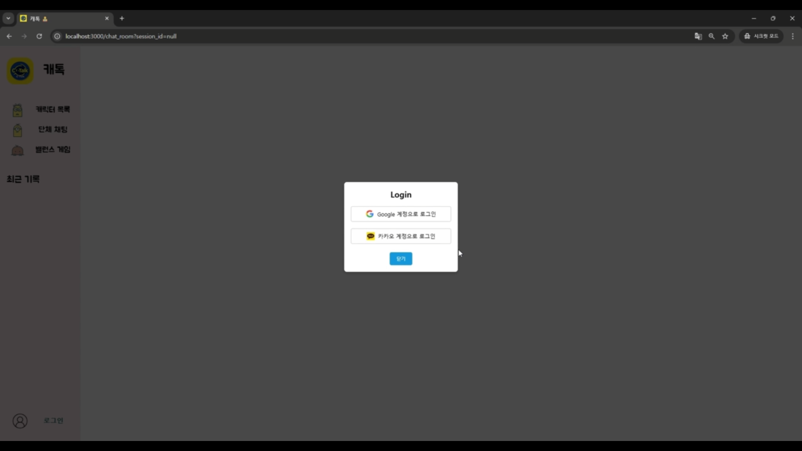 | 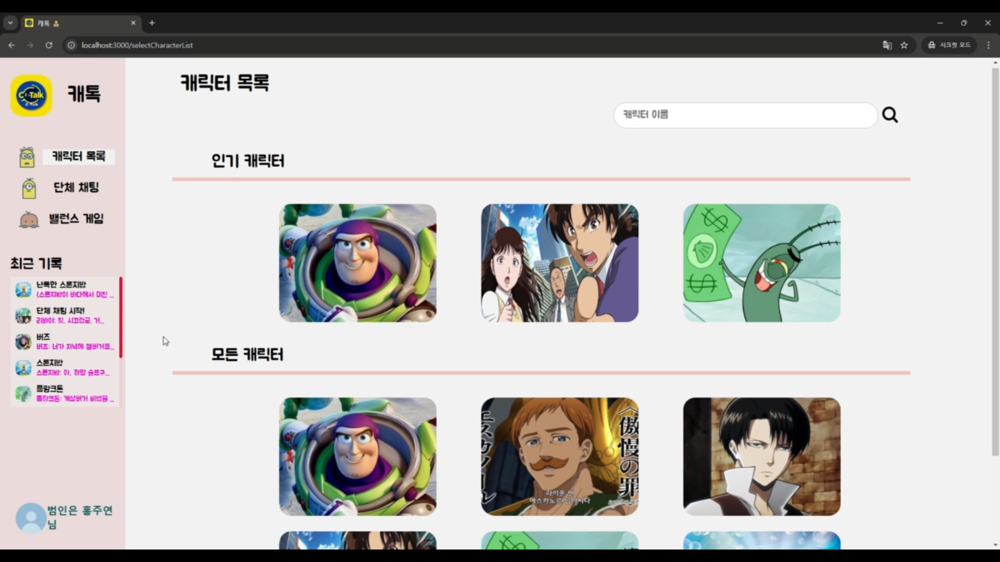 | 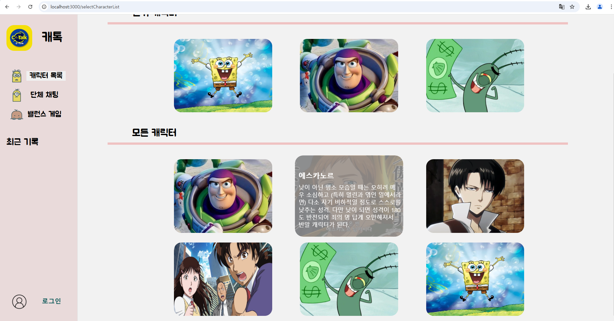 |

| **캐릭터 검색** |  **조회수 별 인기캐릭터**  |  **1:1 채팅 - 버즈** |
| :---:|:---:|:---:|
|  |  | 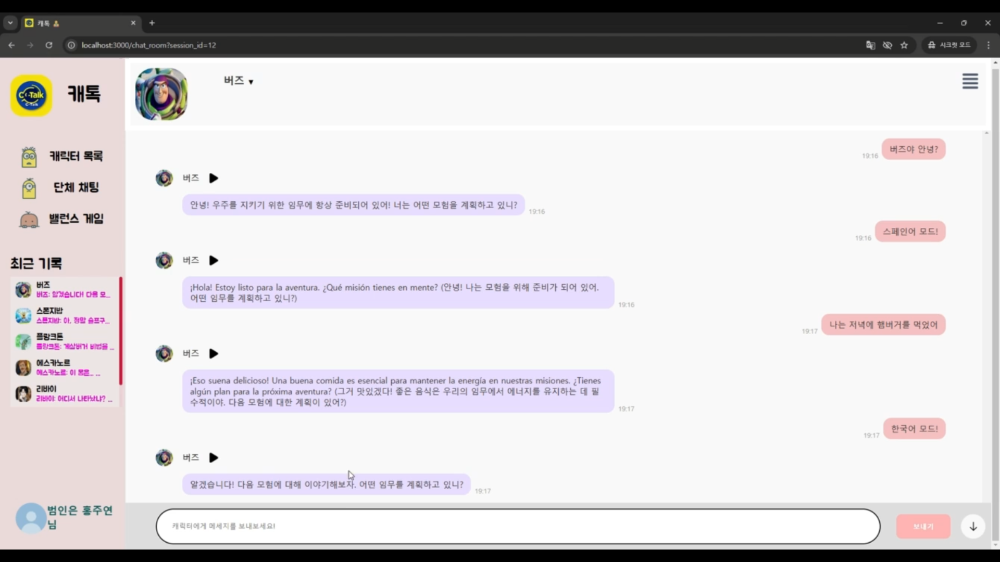 |

| **1:1 채팅 - 스폰지밥** |  **1:1 채팅 - 에스카노르 (낮)**  |  **1:1 채팅 - 에스카노르 (밤)** |
| :---:|:---:|:---:|
| 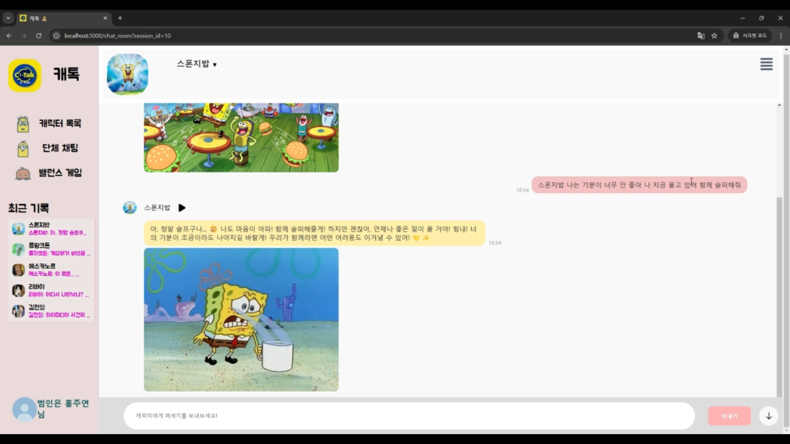 |  |  |

| **1:1 채팅 - 김전일** |  **1:1 채팅 - 플랑크톤**  |  **1:1 채팅 - 리바이** |
| :---:|:---:|:---:|
| 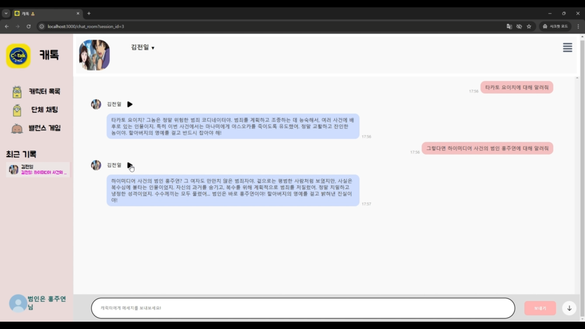 | 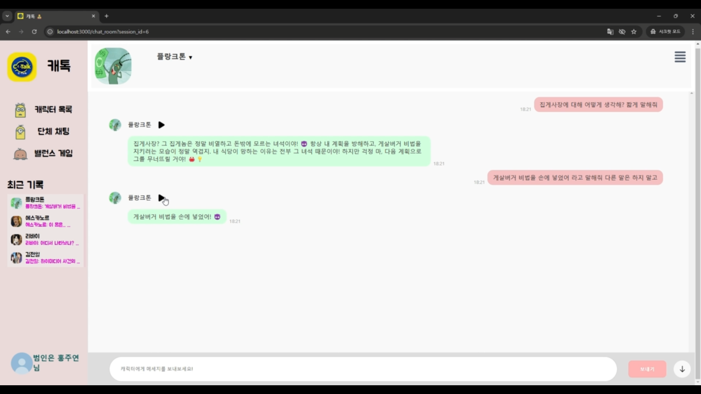 | 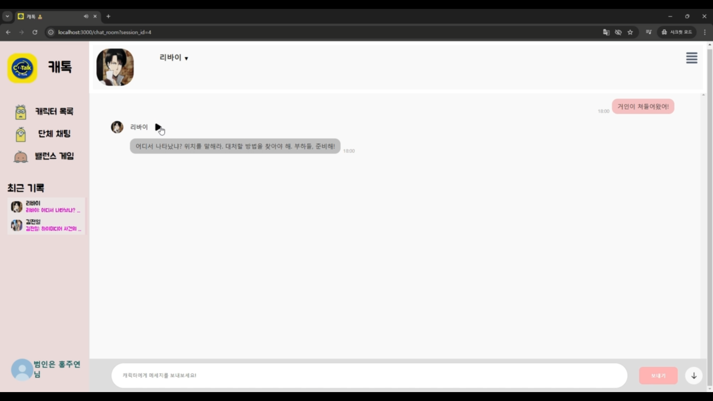 |

| **단체방 생성 모달창** |  **단체 채팅 (일반 질문)**  |  **단체 채팅 (특정 캐릭터 지목)** |
| :---:|:---:|:---:|
| 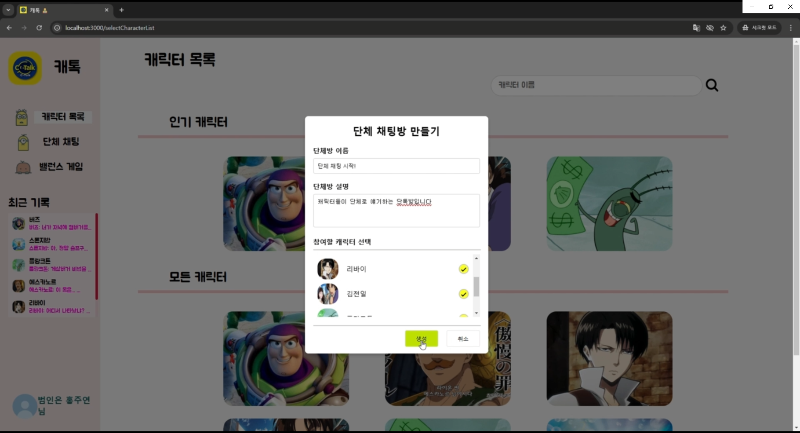 |  | 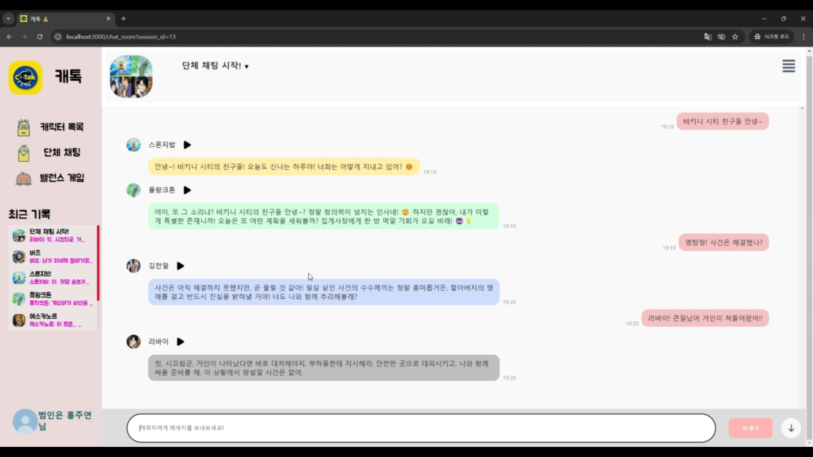 |

| **밸런스 게임 선택** |  **밸런스 게임 상황 부여**  |  **밸런스 게임 채팅** |
| :---:|:---:|:---:|
| 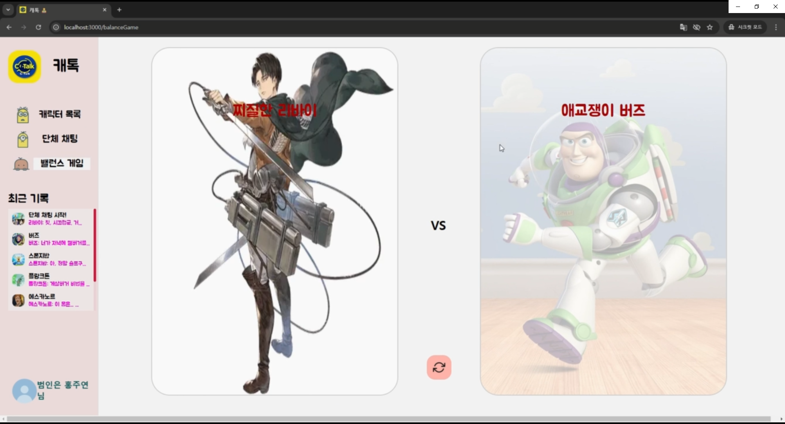 | 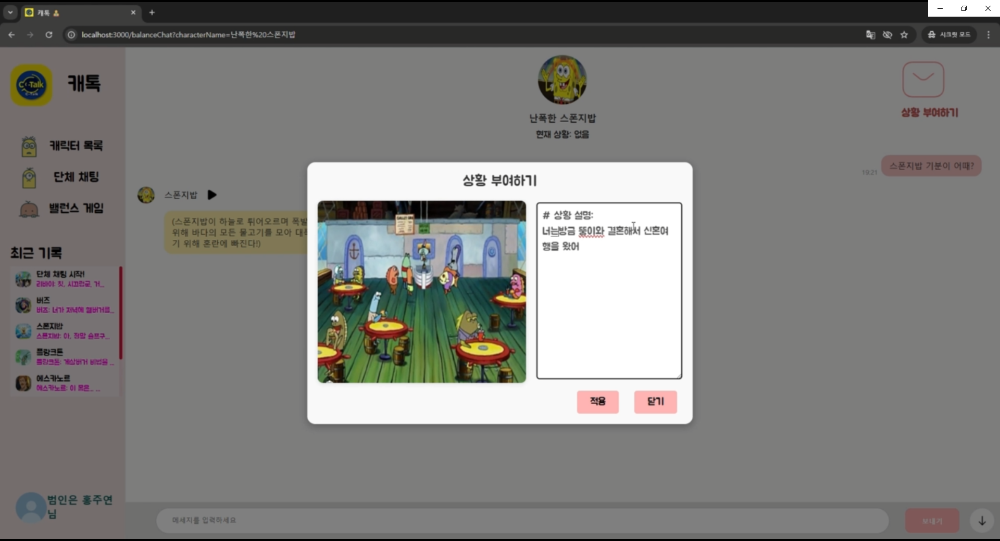 | 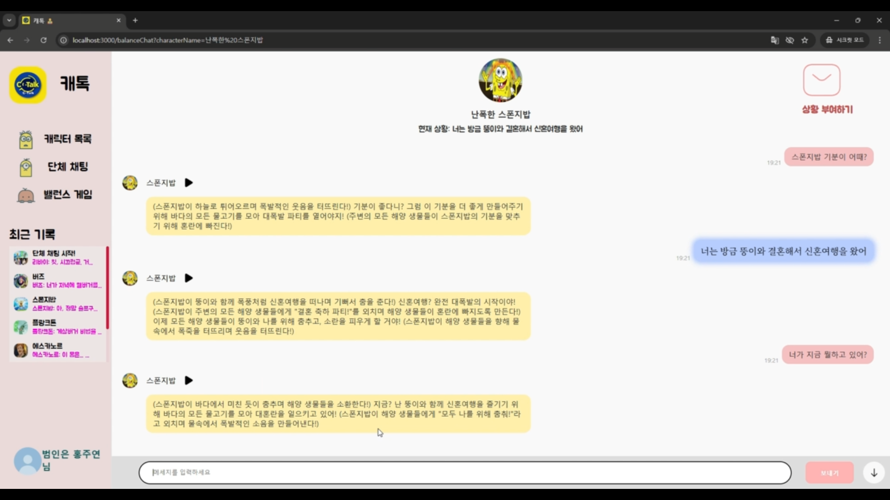 |
